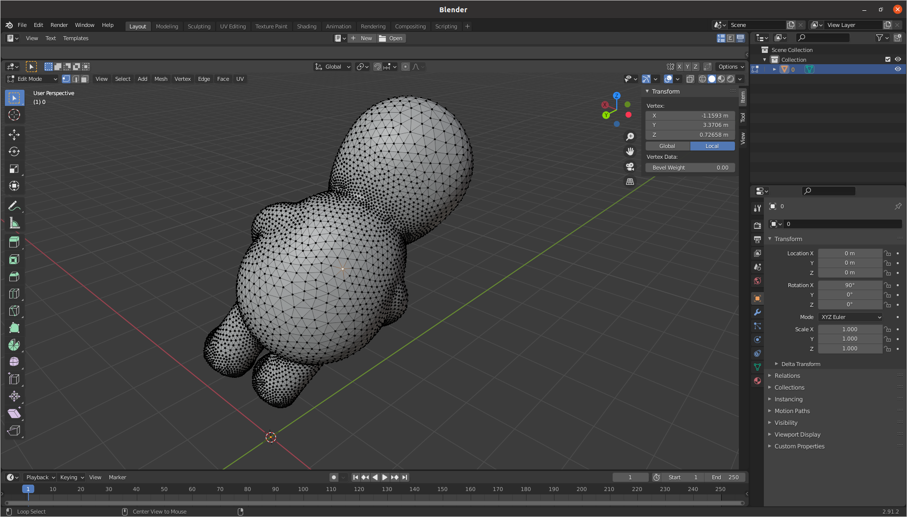
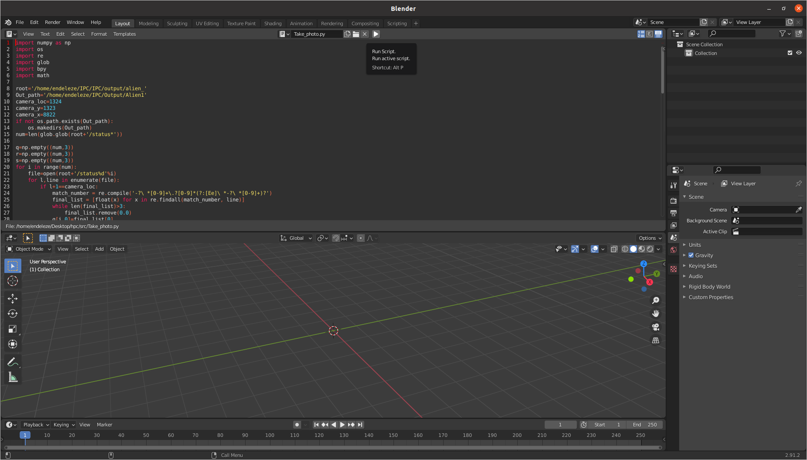

# Virtual Proprioceptive Visual Tutorial
*This tutorial will teach you how to generate virtual proprioceptive visual of a soft robot* 
# Dependancies
* [IPC](https://github.com/ipc-sim/IPC):follow the install instructions in this repositories. 
* [blender](https://www.blender.org/):download to your system. 
# Procedures
## Generate models at every time stamp
1. After you cloned IPC repository, <code>cd PATH_TO_YOUR_DOWNLOAD/IPC/input&&mkdir 1</code>.
2. Convert your model into <code>.msh</code> format following the instruction in IPC.
3. <code>cd 1</code>, write a <code>.txt</code> file, add the <code>.msh</code> model in this file and custom your hyper-parameters following the [instructions](https://github.com/ipc-sim/IPC/wiki).
4. <code>cd ../../&&python batch.py</code> and after runing you will get outputs in <code>output/YOUR_MODEL/</code>. You'll find there're lots of <code>*.obj</code> and <code>status*</code> files which we will need to use in blender later, each file represent a generated model of a time stamp. <image src="notebook_stuff/anim.gif">
## Take photos of each model
1. Open blender, delete system cube, light and camera.
2. In blender, import initial model at <code>PATH_TO_YOUR_DOWNLOAD/IPC/output/YOUR_MODEL/0.obj</code>.
3. Click imported model and press <code>TAB</code>, pick one point that you want to set camera(as origin) which noted as <code>**camera_loc**</code>, find a neighbor point of picked point as head direction(as y axis) of camera noted as <code>**camera_y**</code>, and pick the last neighbor point as <code>**camera_x**</code> that generate a trimesh-voxel with the other two point. **(note: you have two choice for last point, in order to make sure camera z axis point inside into the model, you must choose the one that satisfy right-hand-frame rule)**. View these three points' coordinates in blender and find the lines' numbers at the position section in file <code>PATH_TO_YOUR_DOWNLOAD/IPC/output/YOUR_MODEL/status0</code>.
4. In blender, open a new window and setup Text Editor, open Python code [Take_photo.py](src/Take_photo.py), change line 8 to <code>PATH_TO_YOUR_DOWNLOAD/IPC/output/YOUR_MODEL/</code>, line 9 to <code>PATH_TO_YOUR_OUTPUT_DIR</code>, line 10,11,12 with the line number you found in step 3. 
5. Delete all stuffs in 3D viewpoint window and run script
6. After running, you will get each models' priprioceptive vision under <code>PATH_TO_YOUR_OUTPUT_DIR</code>.
## Generate gif file
Under <code>PATH_TO_YOUR_OUTPUT_DIR</code>, open a terminal and use <code>ffmpeg -i %d.png output.gif</code>, you can custom the speed and so on. For more instractions, check [FFmpeg](https://ffmpeg.org/).<image src="notebook_stuff/Generated.gif">
